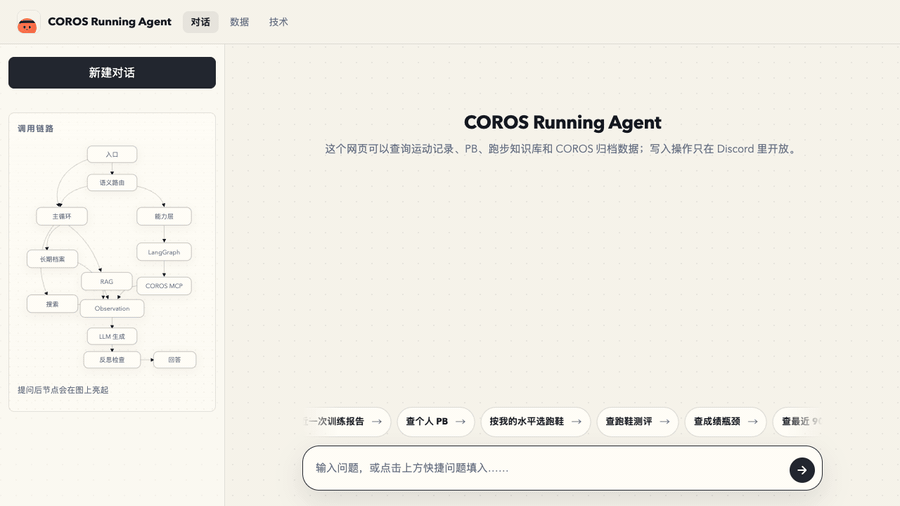
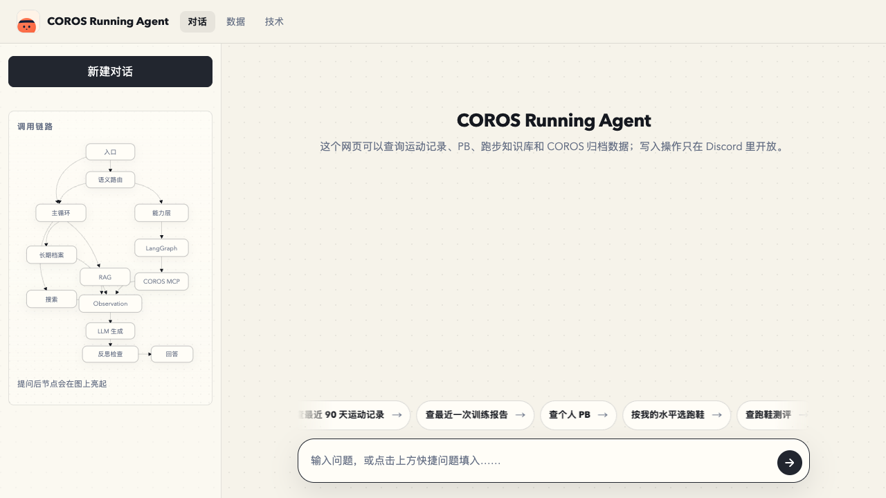
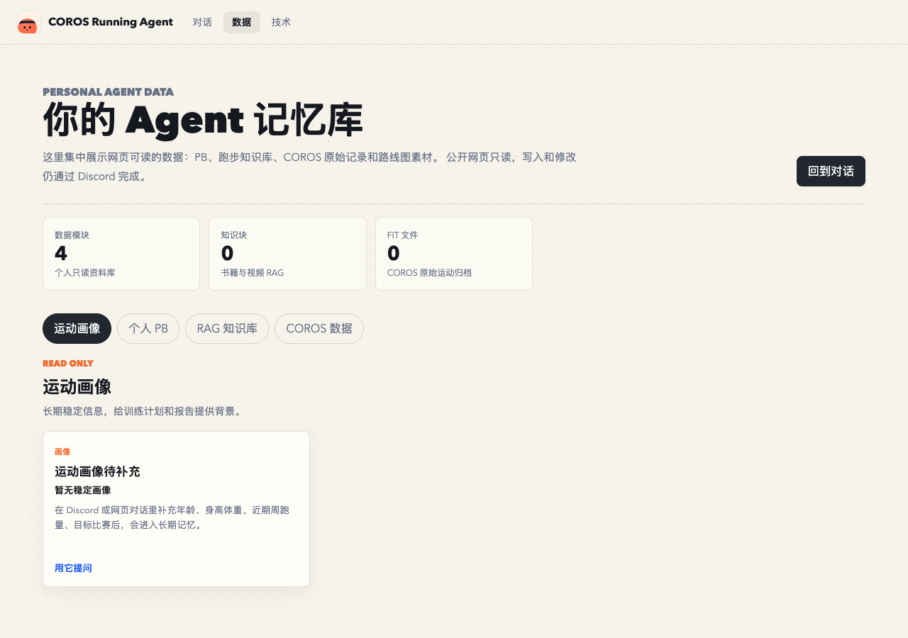
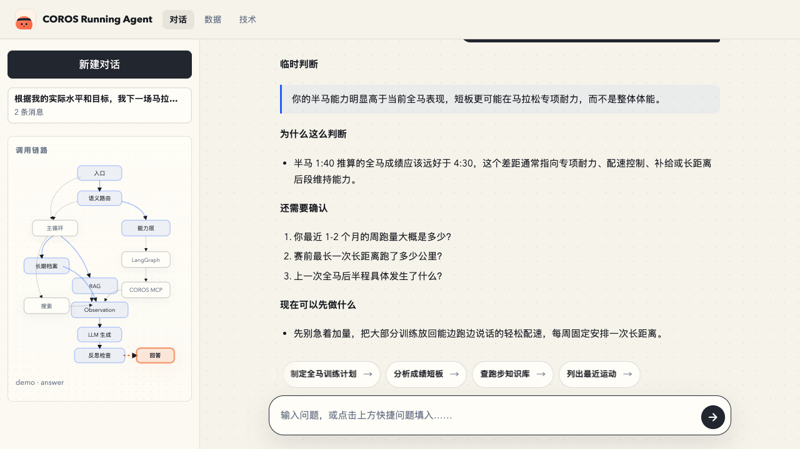
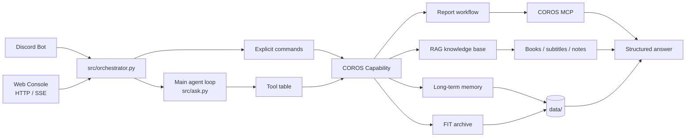

<p align="center">
  
</p>

<h1 align="center">COROS Running Agent</h1>

<p align="center">
  A self-hosted AI running coach that connects COROS training data, workout knowledge, long-term memory, Discord, and a read-only web console.
</p>

<p align="center">
  <a href="README.md"><strong>中文 README</strong></a>
  ·
  <a href="#quick-start"><strong>Quick Start</strong></a>
  ·
  <a href="#architecture"><strong>Architecture</strong></a>
  ·
  <a href="#privacy-and-security"><strong>Privacy</strong></a>
</p>

<p align="center">
  
  
  
  
  
</p>

<br>

> This is not a generic running chatbot. It is designed as a single-user, self-hosted agent that can read your authorized COROS data, your own training materials, and your long-term running profile, then answer questions about your actual training.

## Preview

<p align="center">
  
</p>

<p align="center">
  <em>Ask in natural language. The agent routes the request, calls tools, observes results, reflects on the draft, and streams the final answer.</em>
</p>

<table>
  <tr>
    <td width="33%">
      
    </td>
    <td width="33%">
      
    </td>
    <td width="33%">
      
    </td>
  </tr>
  <tr>
    <td align="center">Web chat console</td>
    <td align="center">Read-only data dashboard</td>
    <td align="center">Answer with live tool trace</td>
  </tr>
</table>

## What It Can Do

| Capability | What it does |
| --- | --- |
| COROS workout analysis | Reads activity data, training load, recovery state, pace, heart rate, and historical performance through COROS MCP. |
| Structured workout reports | Uses a graph workflow for tool planning, data fetching, report generation, critique, and revision. |
| RAG knowledge base | Imports running books, Bilibili subtitles, and training notes, then answers with citations. |
| Long-term running profile | Stores stable facts such as goals, PBs, weekly mileage, injury context, subjective feelings, and race history. |
| Automatic reports | Polls for new COROS activities and sends a report to a Discord channel after a workout. |
| FIT archive | Downloads raw COROS FIT files locally with quota-aware retries and resumable storage. |
| Web console | Provides a public, read-only demo surface with streaming responses, a live execution trace, and a new-activity report prompt. |
| Optional web search | Can use Tavily or Brave Search when the answer depends on current information, such as races, official links, or shoe availability. |

Example questions:

```text
Was my training load too high over the last three weeks?
Why is my marathon result much slower than my half-marathon prediction?
Based on my latest long run, what should I do next?
Use my imported running books to build a marathon training plan.
```

## Quick Start

Requirements:

- Python 3.13+
- [uv](https://github.com/astral-sh/uv)
- Node.js 18+ if you want to connect COROS MCP through `mcp-remote`

```bash
git clone https://github.com/Noah-wang/coros-running-agent.git
cd coros-running-agent
uv sync
cp .env.example .env
```

Minimal model config:

```bash
LLM_API_KEY=sk-...
LLM_BASE_URL=https://api.deepseek.com
LLM_MODEL=deepseek-chat
AGENT_OWNER_NAME=Runner
```

Run the web console in demo mode:

```bash
WEB_AGENT_MODE=demo uv run python -m src.api.web_server --host 127.0.0.1 --port 8787
```

Open:

```text
http://127.0.0.1:8787
```

Run the web console with real tools:

```bash
WEB_AGENT_MODE=real uv run python -m src.api.web_server --host 127.0.0.1 --port 8787
```

Run the Discord bot:

```bash
uv run python -m src.main
```

You need:

```bash
DISCORD_BOT_TOKEN=...
DISCORD_RUNNING_CHANNEL_ID=...
```

## COROS MCP Setup

`COROS_MCP_URL` normally does not need to be changed. The default points to COROS's public MCP endpoint:

```bash
COROS_MCP_URL=https://mcpus.coros.com/mcp
COROS_MCP_CLIENT=mcp-remote@0.1.38
```

The first COROS call will trigger browser-based authorization through `mcp-remote`:

```bash
uv run python scripts/archive_all_fit.py --max-downloads 1
```

After authorization, the token is stored by `mcp-remote` under your home directory. Do not commit any local auth, config, or data files.

Pin the `mcp-remote` version. Its auth cache is version-specific, so using an unpinned package can make the process wait for a new browser authorization and appear to hang.

## Architecture



The main agent is a loop, not a one-shot classifier:

1. Read the user request.
2. Choose a tool.
3. Observe the result.
4. Decide whether another tool is needed.
5. Draft an answer.
6. Run a lightweight reflection check.
7. Either answer, search again, or ask a follow-up question.

Explicit commands such as `!coros-pb` still take a fast path because the user is asking for a deterministic action.

## Knowledge Base

Put running books in:

```text
data/knowledge/coros-report/books/
```

Then ingest:

```bash
uv run python scripts/ingest_books.py
```

The RAG pipeline uses:

- parent-child chunking
- content-hash embedding cache
- optional hybrid retrieval
- citation formatting
- category-aware retrieval for training theory versus shoe reviews

For Bilibili video subtitles, create:

```text
agents/coros_report/config.toml
```

Example:

```toml
[credential]
sessdata = "..."
bili_jct = "..."
buvid = "..."
```

This file must stay local.

## Model Providers

The project uses the OpenAI Python SDK against Chat Completions-compatible APIs. You can use OpenAI, DeepSeek, Qwen, Kimi, OpenRouter, or another compatible endpoint.

```bash
LLM_API_KEY=...
LLM_BASE_URL=https://api.deepseek.com
LLM_MODEL=deepseek-chat

EMBEDDING_API_KEY=...
EMBEDDING_BASE_URL=...
EMBEDDING_MODEL=text-embedding-3-small
```

If a provider does not support `tool_choice="required"`, the code falls back to `tool_choice="auto"`. If a model does not support tool calling at all, the full agent loop will not work well.

## Web And API

The web console exposes:

```text
GET  /
GET  /data
GET  /tech
POST /api/chat
POST /api/chat/stream
GET  /api/data
GET  /api/tech
```

Non-streaming request:

```bash
curl -X POST http://127.0.0.1:8787/api/chat \
  -H 'Content-Type: application/json' \
  -d '{"message":"Show my personal bests","session_id":"demo-user"}'
```

Streaming request:

```bash
curl -N -X POST http://127.0.0.1:8787/api/chat/stream \
  -H 'Content-Type: application/json' \
  -d '{"message":"How was my latest workout?","session_id":"demo-user"}'
```

The public web surface is designed to be read-only. Write actions such as logging feelings, importing videos, or syncing FIT files should stay behind Discord, CLI, or another authenticated interface.

## Privacy And Security

Do not commit:

- `.env`
- `agents/coros_report/config.toml`
- `data/`
- COROS auth files
- Discord tokens
- model API keys
- Bilibili cookies
- imported PDFs, subtitles, embeddings, FIT files, route maps, or conversation logs

Security boundaries:

- read-only web tool table
- write tools are hidden from public web requests
- untrusted data tags around retrieved books, subtitles, and search results
- read-to-write guard inside the agent loop
- output guard for known secret values
- per-source and global rate limits
- daily budget for web search

## Deployment

A small VPS is enough. A common deployment has:

```text
coros-running-agent-web.service      Web console
coros-running-agent-bot.service      Discord bot
coros-running-agent-bili-sync.timer  Subtitle sync
```

Use Caddy or another reverse proxy for HTTPS:

```caddy
agent.example.com {
    reverse_proxy 127.0.0.1:8787
}
```

Deployment templates are in:

```text
deploy/systemd/
```

## Local Checks

```bash
uv run python -m compileall src agents scripts
node --check web/app.js
```

For import-level checks:

```bash
uv run python -c "
import importlib, pkgutil
bad = []
for pkg in ('src', 'agents'):
    for m in pkgutil.walk_packages([pkg], prefix=pkg + '.'):
        try:
            importlib.import_module(m.name)
        except Exception as e:
            bad.append((m.name, e))
print(f'import failures: {len(bad)}')
[print(' ', n, '->', e) for n, e in bad]
"
```

## License

MIT. See [LICENSE](LICENSE).

Books, subtitles, and other materials imported into `data/` are not part of this repository and remain owned by their original authors.
