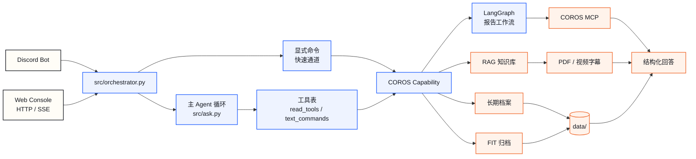

<p align="center">
  
</p>

<h1 align="center">COROS Running Agent</h1>

<p align="center">
  一个自托管的个人跑步教练 Agent，把 COROS 运动数据、训练书籍、跑步视频知识库和长期记忆接进同一个自然语言入口。
</p>

<p align="center">
  <a href="README.en.md"><strong>English README</strong></a>
  ·
  <a href="#快速开始"><strong>快速开始</strong></a>
  ·
  <a href="#架构"><strong>架构</strong></a>
  ·
  <a href="#配置项"><strong>配置</strong></a>
  ·
  <a href="#接入其他应用"><strong>接入应用</strong></a>
  ·
  <a href="#安全设计"><strong>安全设计</strong></a>
</p>

<p align="center">
  
  
  
  
  
</p>

<br>

> 这不是一个泛泛回答跑步常识的聊天机器人。它面向单人自托管场景，
> 读取你自己的 COROS 数据、你导入的训练资料和你的长期档案，然后回答关于**你**的问题。

<table>
  <tr>
    <td width="50%">
      <strong>你可以这样问</strong><br><br>
      <code>我最近三周的训练负荷是不是太高？</code><br>
      <code>根据这次长距离，下一次应该怎么练？</code><br>
      <code>我的全马为什么明显慢于半马推算？</code>
    </td>
    <td width="50%">
      <strong>它会这样做</strong><br><br>
      读取 COROS 活动数据，结合长期记忆、RAG 知识库和训练报告工作流，给出结构化复盘、风险判断和下一步训练建议。
    </td>
  </tr>
</table>

两个入口：Discord 机器人，和一个可以公开挂出去的 Web 控制台。

> 这是一个面向单人自托管场景的跑步 Agent。
> 它是**给个人使用的工具**，不是 SaaS：没有多用户、没有登录，
> 一份部署对应一个人的数据。

## 界面预览

<p align="center">
  
</p>

<p align="center">
  <em>自然语言提问后，主 Agent 会调用工具、观察结果、进行反思检查，再输出回答。</em>
</p>

<table>
  <tr>
    <td width="33%">
      
    </td>
    <td width="33%">
      
    </td>
    <td width="33%">
      
    </td>
  </tr>
  <tr>
    <td align="center">Web 对话控制台</td>
    <td align="center">只读数据页</td>
    <td align="center">回答与调用链路</td>
  </tr>
</table>

---

## 目录

- [界面预览](#界面预览)
- [它能做什么](#它能做什么)
- [快速开始](#快速开始)
- [架构](#架构)
- [用到的开源项目](#用到的开源项目)
- [配置项](#配置项)
- [知识库](#知识库)
- [定时任务](#定时任务)
- [评测](#评测)
- [安全设计](#安全设计)
- [部署](#部署)
- [常见问题](#常见问题)

---

## 它能做什么

<table>
  <tr>
    <td width="33%">
      <strong>个人运动分析</strong><br>
      读取 COROS 训练记录、训练负荷、恢复状态和历史表现，回答关于你自己的开放问题。
    </td>
    <td width="33%">
      <strong>训练报告工作流</strong><br>
      用 LangGraph 拆分工具规划、数据读取、报告生成、critic 审阅和修订输出。
    </td>
    <td width="33%">
      <strong>RAG 知识库问答</strong><br>
      导入训练书籍 PDF 和 B 站跑步视频字幕，按内容方向检索并引用原文。
    </td>
  </tr>
  <tr>
    <td width="33%">
      <strong>视频知识同步</strong><br>
      订阅 B 站 UP 主，定时发现新视频、抓字幕、写入知识库并重建索引。
    </td>
    <td width="33%">
      <strong>长期档案与主观感受</strong><br>
      保存年龄、体重、PB、目标、周跑量，以及数据里看不出来的训练体感。
    </td>
    <td width="33%">
      <strong>FIT 文件归档</strong><br>
      把 COROS 历史活动原始 FIT 拉到本地，幂等执行，可断点续传。
    </td>
  </tr>
  <tr>
    <td width="33%">
      <strong>Discord 交互</strong><br>
      在个人训练频道里自动推送报告、记录感受、导入知识和触发查询。
    </td>
    <td width="33%">
      <strong>Web 控制台</strong><br>
      公开只读 Demo，支持 SSE 流式输出、调用链路高亮，以及新运动检测弹窗。
    </td>
    <td width="33%">
      <strong>可选联网搜索</strong><br>
      赛事安排、天气、知识库外信息可接 Tavily 或 Brave Search。
    </td>
  </tr>
</table>

---

## 快速开始

<table>
  <tr>
    <td align="center"><strong>1</strong><br>安装依赖</td>
    <td align="center"><strong>2</strong><br>填写模型配置</td>
    <td align="center"><strong>3</strong><br>连接 COROS MCP</td>
    <td align="center"><strong>4</strong><br>启动 Web 或 Discord</td>
  </tr>
</table>

### 1. 装依赖

需要 Python 3.13+ 和 [uv](https://github.com/astral-sh/uv)。

**接 COROS 数据还需要 Node.js 18+**——COROS 的 MCP 服务通过 `npx mcp-remote`
连接，那是一个 Node 包。只用知识库问答的话不需要。

```bash
git clone <your-fork-url> coros-running-agent
cd coros-running-agent
uv sync
```

### 2. 配置

```bash
cp .env.example .env
```

**最小可运行配置**只要两项：

```bash
LLM_API_KEY=sk-...             # OpenAI / DeepSeek / Qwen / Kimi / OpenRouter 等
LLM_BASE_URL=https://api.deepseek.com
LLM_MODEL=deepseek-chat
AGENT_OWNER_NAME=你的名字        # 出现在系统提示词里
```

这样就能启动 Web 控制台并问知识库问题了。

### 2.5 接入 COROS（可选）

`COROS_MCP_URL` **通常不用改**——默认值 `https://mcpus.coros.com/mcp`
就是 COROS 官方的公共端点，所有用户共用同一个地址，区别在于各自的授权。

真正要做的是**首次授权**。第一次调用 COROS 时，`mcp-remote` 会打开浏览器
让你登录 COROS 账号：

```bash
uv run python scripts/archive_all_fit.py --max-downloads 1
```

浏览器里授权完成后，令牌会存在 `~/.mcp-auth/mcp-remote-<版本>/`，之后不用再授权。

**令牌是按 mcp-remote 的版本号分目录存的。** 所以 `COROS_MCP_CLIENT` 必须写死版本
（默认 `mcp-remote@0.1.38`）——不带版本时 `npx` 会拉最新版，那个目录里没有令牌，
程序会停在等待授权那一步**永远不返回**，表现是请求一直挂着。升级要主动做并重新授权。

### 3. 起 Web 控制台

```bash
WEB_AGENT_MODE=real uv run python -m src.api.web_server --host 127.0.0.1 --port 8787
```

打开 <http://127.0.0.1:8787>。

不配任何 key 时用 `WEB_AGENT_MODE=demo`（默认）——走本地假路由和固定文案，
可以离线看界面长什么样。

### 4.（可选）起 Discord 机器人

```bash
uv run python -m src.main
```

需要 `DISCORD_BOT_TOKEN` 和 `DISCORD_RUNNING_CHANNEL_ID`。
**写操作只在 Discord 开放**，Web 入口是只读的——原因见[安全设计](#安全设计)。

---

## 架构



### 主 Agent 是一个循环，不是一个分类器

最早的版本是「分类器挑一个命令」：模型看一眼用户的话，选一个命令执行完就结束。
问题是**分类器只能在看到任何数据之前猜一次，猜错了没有第二次机会**。
问「我一共跑过几场比赛」，它会选「列出运动记录」，然后倒出 20 条日常训练。

现在是循环：模型拿到工具表，调一个，看结果，再决定下一步。
**决定发生在看到数据之后。**

循环后面还有一个轻量的 Reflection 节点。它不负责重新回答，只检查草稿是否满足问题：
有没有该查 COROS 却没查、该查 RAG 却没查、问官网/报名/库存/当前购买建议却没联网。
如果不够，它会把缺口转成一次补救请求，让主 Agent 再走一轮工具循环；如果资料本来就
补不齐，例如缺年龄、周跑量、目标日期，它会直接追问用户。

`!coros-pb` 这类显式命令仍然走快速通道绕过循环——用户打命令就是要确定的输出，
不需要模型再想一遍。原来的分类器保留在 `MAIN_AGENT_LOOP_ENABLED` 开关后面作为回退。

### 能力（Capability）是怎么接进来的

一个能力包提供两类东西：

| 类型            | 是什么                 | 例子                                |
| --------------- | ---------------------- | ----------------------------------- |
| `read_tools`    | 结构化取数，给模型吃   | `list_recent_activities`             |
| `text_commands` | 执行动作，输出给人看   | `!coros`（生成报告）、`!feel`（记感受）|

`text_commands` 会被自动包装成工具：命令处理器本来是往频道发消息的，
包装时给它一个 `send` 写进缓冲区的上下文，缓冲区内容就是工具返回值。

**加一个能力 = 加一个目录。** `src/registry.py` 扫描 `agents/*/xxx_capability.py`，
找到 `build_*_capability()` 就装上。删掉目录能力就消失，不用改任何代码。

`src/` 从不 import `agents/` 里的具体模块——这条边界让运行时可以独立于领域逻辑演进。

### 权限挂在工具表上

这是整个设计里最重要的一条：

```python
TextCommand(name="feel", writes=True, ...)     # 写工具
Tool(name="list_recent_activities", ...)       # 只读工具
```

构造工具表时，只读入口**直接跳过写工具**——它们根本不出现在发给模型的
tools 参数里。**模型看不见的工具不可能被调用。**

这比「让模型自己别调」或者「调了再拦截」都强：前者靠提示词，可以被绕过；
后者的拦截逻辑本身可能有洞。工具表是结构性的。

### 数据流

```
data/
├── memory.json                      长期记忆（档案、感受）+ 临时缓存，两个命名空间分开
├── conversations/                   只追加的 JSONL 会话日志
├── photo-memory/photos.json         比赛照片的赛事名/日期/成绩标注
├── media/photo-memory/              照片原图
├── coros-report/fit-files/          FIT 归档
└── knowledge/coros-report/
    ├── books/                       你自己放的 PDF
    ├── videos/shoes/                跑鞋测评字幕（自动同步）
    ├── videos/training/             训练理论字幕
    ├── chunks.json                  分块结果
    ├── embeddings.json              向量（按内容哈希缓存）
    └── index.json                   BM25 关键词索引
```

**会话历史只追加、不改写。** 内存里的窗口是这份日志的一个视图，
压缩只是往日志里写一条覆盖标记，原文一行不删。进程重启后按日志重建。

更详细的设计取舍见 [docs/ARCHITECTURE.md](docs/ARCHITECTURE.md)，
RAG 那部分单独写在 [docs/rag-pipeline.md](docs/rag-pipeline.md)。

---

## 用到的开源项目

| 项目 | 用途 | 为什么是它 |
| --- | --- | --- |
| [uv](https://github.com/astral-sh/uv) | 依赖与虚拟环境管理 | 解析和安装比 pip 快一个数量级，`uv.lock` 保证跨机器一致 |
| [openai-python](https://github.com/openai/openai-python) | 模型调用 | 只用它的 HTTP 客户端和类型，**任何 OpenAI 兼容接口都能接**（默认 DeepSeek） |
| [LangGraph](https://github.com/langchain-ai/langgraph) | 运动报告的内部工作流 | 报告生成是固定的多步流程（取数 → 生成 → critic 审阅 → 修订），用状态图表达比手写 if 清楚 |
| [discord.py](https://github.com/Rapptz/discord.py) | Discord 入口 | 成熟、异步、事件模型干净 |
| [MCP Python SDK](https://github.com/modelcontextprotocol/python-sdk) | 连 COROS 数据源 | COROS 的数据通过 MCP 服务暴露，用官方 SDK 而不是自己拼协议 |
| [bilibili-api-python](https://github.com/Nemo2011/bilibili-api) | B 站视频列表与字幕 | WBI 签名依赖未公开接口，B 站会不定期改，让一个持续更新的库去跟比自己写划算 |
| [httpx](https://github.com/encode/httpx) | 异步 HTTP | 字幕抓取要并发和超时控制 |
| [pypdf](https://github.com/py-pdf/pypdf) | 解析训练书籍 PDF | 纯 Python，没有系统级依赖 |
| [NumPy](https://numpy.org/) | 向量检索 | 相似度计算向量化。**缺失时自动退回纯 Python**，不是硬依赖 |
| [python-dotenv](https://github.com/theskumar/python-dotenv) | 读 `.env` | 标准做法 |
| [Caddy](https://caddyserver.com/) | 反向代理与 HTTPS | 自动证书，配置文件三行 |

**刻意没有用的东西**，以及原因：

- **向量数据库**（Chroma / Qdrant / pgvector）：当前语料几百个块，
  瓶颈在 JSON 解析而不是相似度计算。触发迁移的具体信号是
  `embeddings.json` 超过 100MB 或加载超过 1 秒——**在那之前，
  多一个服务只是多一个会在半夜挂掉的东西**。
- **RSSHub**（监听 B 站更新）：那要多养一个常驻容器，而同样的事
  一个 pip 包就能做。
- **MCP 版的搜索工具**：每次调用要起一个 node 子进程（5~15 秒），
  而搜索是用户等着的同步调用；key 写在 URL 里还会进进程列表和日志。
- **混合检索（RRF）**：实现了，实测在这个语料上比纯向量更差，默认关闭。
  代码留着，开关在 `RAG_HYBRID_ENABLED`。

---

## 配置项

完整列表见 `.env.example`。常用的：

### 模型

模型调用统一走 OpenAI Python SDK 的 Chat Completions 兼容接口。
换模型供应商时只改三项：

```bash
LLM_API_KEY=sk-...
LLM_BASE_URL=https://api.deepseek.com
LLM_MODEL=deepseek-chat

EMBEDDING_API_KEY=...                        # 不填则复用 LLM_API_KEY
EMBEDDING_BASE_URL=...                       # 不填则复用 LLM_BASE_URL
EMBEDDING_MODEL=text-embedding-3-small
```

常见 OpenAI 兼容接口：

| 供应商 | `LLM_BASE_URL` | `LLM_MODEL` 示例 | 说明 |
| --- | --- | --- | --- |
| OpenAI | `https://api.openai.com/v1` | 选择你的 Chat Completions 模型 | 官方 API 入口 |
| DeepSeek | `https://api.deepseek.com` | `deepseek-chat` | DeepSeek 文档标注为 OpenAI Format |
| 通义千问 / DashScope 国际站 | `https://dashscope-intl.aliyuncs.com/compatible-mode/v1` | `qwen-plus` | 国际站旧域名仍可用；新项目也可换成 workspace 专属域名 |
| 通义千问 / DashScope 美国 | `https://dashscope-us.aliyuncs.com/compatible-mode/v1` | `qwen-plus` | 美国 Virginia 区域 |
| Kimi / Moonshot | `https://api.moonshot.ai/v1` | `kimi-k2.6` | Kimi 官方兼容 OpenAI SDK |
| OpenRouter | `https://openrouter.ai/api/v1` | `openai/gpt-4o` | 一个 key 路由多个模型供应商 |

<table>
  <tr>
    <td align="center"><strong>OpenAI</strong><br><code>api.openai.com/v1</code></td>
    <td align="center"><strong>DeepSeek</strong><br><code>api.deepseek.com</code></td>
    <td align="center"><strong>Qwen</strong><br><code>compatible-mode/v1</code></td>
  </tr>
  <tr>
    <td align="center"><strong>Kimi</strong><br><code>api.moonshot.ai/v1</code></td>
    <td align="center"><strong>OpenRouter</strong><br><code>openrouter.ai/api/v1</code></td>
    <td align="center"><strong>Custom</strong><br><code>OpenAI compatible</code></td>
  </tr>
</table>

如果某个供应商不支持 `tool_choice="required"`，代码会自动退回 `tool_choice="auto"`。
如果某个模型不支持 tool calling，就不能跑完整主 Agent 循环，建议换支持工具调用的模型。

### 数据源

```bash
COROS_MCP_URL=...                  # 一般不用填，默认就是 COROS 官方公共端点
COROS_MCP_CLIENT=mcp-remote@0.1.38 # 固定版本，别用不带版本的写法（见常见问题）
```

### 入口

```bash
DISCORD_BOT_TOKEN=...
DISCORD_RUNNING_CHANNEL_ID=...     # 只在这个频道响应

COROS_AUTO_REPORT_ENABLED=true
COROS_AUTO_REPORT_POLL_MINUTES=15
COROS_AUTO_REPORT_STABLE_MINUTES=60 # 等运动结束并稳定后再自动推送，避免同步中的半截记录
COROS_AUTO_REPORT_SEND_ON_FIRST_RUN=false

WEB_AGENT_MODE=real                # demo = 离线假数据
WEB_PUBLIC_DOMAIN=agent.example.com
WEB_RATE_LIMIT_PER_MINUTE=10
WEB_RATE_LIMIT_GLOBAL_PER_MINUTE=60
```

### 接入其他应用

这个项目默认有三个可复用入口：

| 入口 | 适合接什么 | 说明 |
| --- | --- | --- |
| Discord bot | Discord 社群、个人训练频道 | 支持读写：自动报告、记录感受、导入视频知识 |
| Web 控制台 | 公开 Demo、作品集页面、只读查询 | 支持 SSE 流式输出和调用链路高亮；默认只读 |
| HTTP API | 微信服务号、Telegram、飞书、自己的前后端项目 | 由外部应用转发用户消息到 `/api/chat` 或 `/api/chat/stream` |

非流式调用：

```bash
curl -X POST http://127.0.0.1:8787/api/chat \
  -H 'Content-Type: application/json' \
  -d '{"message":"查我的个人 PB","session_id":"demo-user"}'
```

流式调用：

```bash
curl -N -X POST http://127.0.0.1:8787/api/chat/stream \
  -H 'Content-Type: application/json' \
  -d '{"message":"我今天这次训练怎么样？","session_id":"demo-user"}'
```

`session_id` 用来区分不同外部用户或不同会话。接微信、Telegram、飞书时，
可以用平台的用户 ID 或会话 ID 作为 `session_id`。

重要边界：公开 Web / HTTP 入口默认按只读设计。记录感受、导入视频、修改长期记忆
这类写操作建议只放在受控入口，比如你自己的 Discord 频道，或者在外部应用层先做登录鉴权。

### 检索

```bash
CHUNK_SIZE=1200
CHILD_CHUNK_SIZE=700
RAG_HYBRID_ENABLED=false
```

### 可选

```bash
TAVILY_API_KEY=...                 # 或 BRAVE_SEARCH_API_KEY，都不填则不启用搜索
WEB_SEARCH_DAILY_LIMIT=50
ANSWER_REFLECTION_ENABLED=true     # 回答前检查是否需要补查/追问
LOG_PROMPTS=0                      # 调试时才开，提示词里有个人数据
```

---

## 知识库

### 放书

把 PDF 丢进 `data/knowledge/coros-report/books/`，然后：

```bash
uv run python scripts/ingest_books.py
```

分块策略是**父子分块**：先切 1200 字的父块保上下文，再切 700 字的子块用来匹配。
检索时子块命中，投喂父块。跨页合并、按语义边界切分、页眉页脚去噪都在
`src/runtime/chunking.py` 里。

嵌入按**内容哈希**缓存：加一本新书只算新增的块，已有的直接复用。

### 导入 B 站视频

单条：

```bash
# Discord 里
!running-video https://www.bilibili.com/video/BV1...
```

订阅一个 UP 主，让它自动同步：

```bash
# Discord 里，把空间链接发给它
!knowledge-source https://space.bilibili.com/32360754 shoes
```

订阅名单落在 `data/knowledge/coros-report/sources.json`，
分类只能是 `shoes` 或 `training`——它决定视频进哪个目录，
也决定检索时属于哪个内容方向。

抓字幕需要 B 站登录态，放在 `agents/coros_report/config.toml`（**这个文件不要提交**）：

```toml
[credential]
sessdata = "..."
bili_jct = "..."
buvid = "..."
```

### 检索为什么要分类

书和跑鞋测评的用词高度重叠：配速、脚感、体重、里程。
问「我这个水平该选什么跑鞋」，纯靠语义相似度会把训练理论排进前三——
它们确实在讲「跑者水平」，但对选鞋没用。**区别是意图上的，不是文本上的。**

所以先按分类缩范围，再排序。认不出的分类名（模型可能传 `跑鞋`、`shoe`、
`running_shoes`）**返回全部而不是返回空**——退化成「没分类」只是效果差一点，
返回空则整个知识库查不到东西，而且失败形态是「什么都没查到」，看起来像库是空的。

---

## 定时任务

`deploy/systemd/` 下有现成的 unit 文件。

### B 站字幕同步

每半小时一轮，单轮 8 条，订阅源之间平分配额。

```bash
sudo cp deploy/systemd/*.service deploy/systemd/*.timer /etc/systemd/system/
sudo systemctl daemon-reload
sudo systemctl enable --now coros-running-agent-bili-sync.timer
```

手动跑一次看会导入什么：

```bash
uv run python scripts/sync_bilibili.py --dry-run
```

**限流卡在「列视频」而不是「抓字幕」**——这是实测出来的，和直觉相反。
字幕连抓 15 条（间隔 4 秒）零失败，而空间列表接口打几次就 -799/412。
所以视频列表缓存 20 小时，列表请求失败时退回缓存继续回填，连续出错则熔断。

熔断之后会写一个冷静期文件，接下来两小时的定时任务直接退出。
**提高频率必须同时提高退让能力**，否则只是把出错的代价也放大了 48 倍。

### FIT 归档

```bash
uv run python scripts/archive_all_fit.py --max-downloads 45
```

COROS 对 FIT 下载有每日配额（实测约 50 次），而且**配额用完时接口不报错、
只返回空**，和「这条活动本来就没有 FIT」无法区分。所以脚本带熔断：
连续 5 条失败就停并说明原因。`--max-downloads` 把单次运行压在配额以内。

---

## 本地检查

开源版不内置私有评测数据集——真实评测通常会绑定本地知识库和训练记录，
直接发布对别人没有参考价值。但下面这条检查值得每次改完都跑：

```bash
uv run python -c "
import importlib, pkgutil
bad = []
for pkg in ('src', 'agents'):
    for m in pkgutil.walk_packages([pkg], prefix=pkg + '.'):
        try:
            importlib.import_module(m.name)
        except Exception as e:
            bad.append((m.name, e))
print(f'导入失败 {len(bad)} 个')
[print(' ', n, '->', e) for n, e in bad]
"
```

**不要用 `python -m compileall` 代替它。** compileall 只编译字节码、不执行导入，
一个不存在的模块名它照样放行——实测插入 `import nonexistent_module` 之后
compileall 依然报「通过」，而真正导入时是 `ModuleNotFoundError`。

改动后建议再确认：

| 检查项 | 怎么确认 |
| --- | --- |
| 模块导入 | 上面那条命令，失败数为 0 |
| Demo 页面 | 不配任何 key 起 `WEB_AGENT_MODE=demo`，三个页面都能打开 |
| 权限边界 | 只读入口的工具表里不该出现写工具（`feel`、`running-video`、`coros-fit-sync`） |

---

## 安全设计

这个项目默认会被挂到公网上，所以有几层是必须的。

### 公开入口只读

Web 控制台没有登录。选择是：保留个人档案的**读**，但**所有写操作都不开放**。
实现方式是上面说的工具表——写工具在只读入口构造时就被跳过了。

### 不可信内容边界

外部来源的文本（书籍原文、B 站字幕、搜索结果）进提示词前会被包进
`<untrusted-data>` 标签，内容里的标签字面量先被打断，防止攻击者自行闭合跳出边界。
系统提示里有一条常驻规则说明标签内只是数据。

### 读→写闸门

比标签更重要的一层。`Tool` 有 `writes` 和 `returns_untrusted` 两个属性，
**主循环一旦读取过外部内容，本轮剩下的写操作一律拒绝**。

注入的典型形态是「先让 agent 读到被投毒的资料，再诱导它去写」。
把这两步隔开就切断了利用链，不依赖模型自己识别攻击。

### 出站检查

发给用户的文本会过一遍 `src/runtime/output_guard.py`：抹掉环境变量里的
真实密钥值，删掉泄露的边界标签。它**只做精确匹配这类零误报的事**——
会误伤正常回答的安全层最终会被关掉，那比没有更糟。

### 两层限流

按来源挡单 IP 高频，按全局挡分散来源。只按 IP 限流保护不了模型账单，
因为账单是按总量算的。真实 IP 取 `X-Forwarded-For` 的最后一段
（反向代理追加的那段，客户端伪造不了）。

搜索另有独立的**每日预算**，因为它按次收费而入口无认证——每分钟限流
不能阻止一天累计烧掉整个额度。

### 提示词不记明文

日志默认只记提示词指纹。里面有成绩、伤病、目标。
需要复现模型异常输出时用 `LOG_PROMPTS=1` 临时开启。

---

## 部署

一台小 VPS 就够。常见部署由 Web、Discord bot 和定时任务组成。

```
your-agent.service         Web 控制台
your-agent-bot.service     Discord 机器人
coros-running-agent-bili-sync.timer  每半小时同步字幕
可选：自建 FIT 归档 timer，定时调用 scripts/archive_all_fit.py
```

前面用 Caddy 反代，HTTPS 自动签：

```caddy
agent.example.com {
    reverse_proxy 127.0.0.1:8787
}
```

**这些是必须留在服务器上、不进仓库的**：`.env`、`agents/coros_report/config.toml`、
整个 `data/` 目录。部署脚本要显式排除它们——一次 `rsync --delete` 忘了加排除
就能把你的会话历史和登录态清空。

---

## 常见问题

**「正在输入」一直亮着 / 请求永远不返回**

多半是 `COROS_MCP_CLIENT` 写成了不带版本的 `mcp-remote`。
它把 OAuth 令牌按版本存在 `~/.mcp-auth/mcp-remote-<版本>/`，
`npx` 拉到新版本时那个目录里没有令牌，于是它停在等待授权那一步永远不返回。
**固定版本号**，升级要主动做并重新授权一次。

**RAG 检索退回了关键词模式**

`embeddings.json` 的向量数和 `chunks.json` 的块数对不上时会触发一致性守卫。
常见原因是换了嵌入模型，或者只给一部分块建了索引——
**索引必须建在全量块上，分类过滤只能是查询期的事**。重跑 `ingest_books.py`。

**B 站同步一直导入 0 条**

先看 `--dry-run` 输出的「列表来源」。如果是「请求返回空且无缓存」，
基本就是触发了风控——而**「被限流」和「这个人没发过视频」返回结构一模一样**，
不看这一行区分不出来。等冷静期过（`.video-index/cooldown.json`），别硬重试。

**问「跑过几场比赛」，它去列了日常训练**

比赛和训练是两个数据源：比赛记在照片能力的标注里（`list_races`），
训练来自 COROS（`list_recent_activities`）。提示词里有一段专门区分它们，
但这段**只在 `list_races` 存在时才拼进去**——如果你删掉了照片能力，
它就不会出现，模型也不会去调一个不存在的工具。

如果它还是混了，检查 `data/photo-memory/photos.json` 里有没有标注了赛事名的分组。

---

## License

MIT。见 [LICENSE](LICENSE)。

书籍、视频字幕等你自己导入的资料**不属于本项目**，它们的版权归原作者。
不要把 `data/` 提交到公开仓库。
